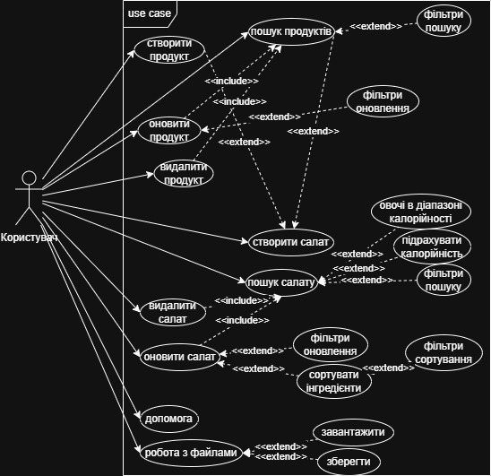
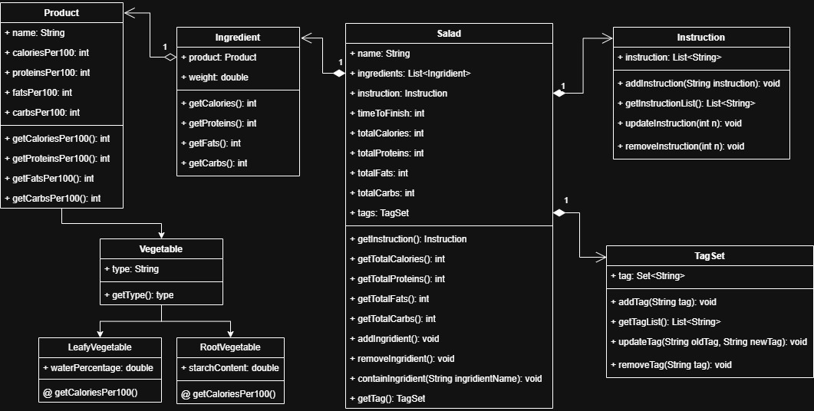

# Комплексна лабораторна робота (Java ООП, Лабораторні 4–8)

Цей проєкт є **комплексною лабораторною роботою (лаби 4–8)**.  
Метою є створення **консольного застосунку**, що демонструє принципи **ООП** та використання патернів проєктування.

---

## 🧭 Процес виконання лабораторних робіт

| Етап | Опис                                                                      | Статус |
|------|---------------------------------------------------------------------------|--------|
| **Лаб. 4** | Аналіз предметної області, створення Use Case та Class діаграм.           | ✅ Виконано |
| **Лаб. 5** | Реалізація консольного меню з використанням **патерну Command** (кістяк). | ⏳ Заплановано |
| **Лаб. 6** | Додавання бізнес-логіки та сервісів (`SaladService`, `ProductService`).   | ⏳ Заплановано |
| **Лаб. 7** | Написання юніт-тестів (coverage ≥90%).                                    | ⏳ Заплановано |
| **Лаб. 8** | Додавання логування, роботи з файлами та обробки винятків.                | ⏳ Заплановано |

---

# Приклади

## Лаб. 4
### Use case діаграма 

---
### Class діаграма

---

## Автор
- [@egoRikP](https://github.com/egoRikP)
---